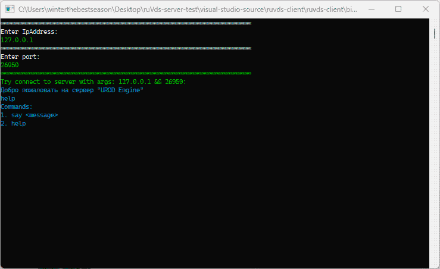

## server mini-application for linux-x64 systems - "Chat"

<details><summary> What may be useful: </summary>

git. in order to use it, install it on a Linux device </br>
arch -> ``` pacman -S git ``` </br>
debian -> ``` apt-get install git ``` </br>
</details>

<details><summary> ruVds site interface: </summary>
  

</details>
<details><summary> PuTTY interface:</summary>

Having connected to the vds machine via ssh, the next step is to install this terminal application via git clone </br>
the repository is installed via git clone</br>
via cd the user gets to ./ruVds-server-test/server/linux-x64/ruvds-tcp </br>
via chmod 755 ./ruvds-tcp the user gets permission to run the application </br>
via ./ruvds-tcp the user launches the server application </br>


then on the server the user enters the external ip vds of the machine </br>
then on the server the user enters the port on which listening will be done </br>
profit </br>


</details>

<details><summary> Client interface:</summary>

By analogy with launching a server application, a client application is launched </br>
but instead of ./ruVds-server-test/server/linux-x64/ruvds-tcp </br>
you need to go to the directory ./ruVds-server-test/client/linux-x64/ruvds-client </br>



-----------------

the application will ask you to enter the external server IP to connect to it </br>
if you receive the message: Welcome to the server "UROD Engine" </br>
then you have successfully connected to the server and can now display help with the help command </br>
to communicate with other users, write say and a message after it </br>
</details>

----------------------------------------

the program will ask you to enter the ip, and then the port.

----------------------------------------
