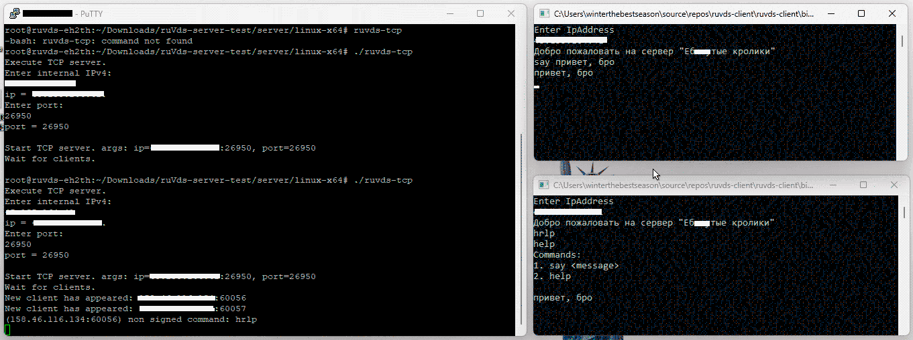

## серверное мини-приложение для linux-x64 систем - "Чат"

<details><summary> Что может пригодиться </summary>

git. для того, чтобы им пользоваться, установите его на linux-устройство </br>
arch -> ``` pacman -S git ``` </br>
debian -> ``` apt-get install git ``` </br> 
</details>

<details><summary> Внешний вид ruVds </summary>
  

</details>
<details><summary> PuTTY интерфейс</summary>

Подключившись к vds машине по ssh далее идет установка этого терминального приложения через git clone </br>
через git clone устанавливается репозиторий```</br>
через cd пользователь добирается до ./ruVds-server-test/server/linux-x64/ruvds-tcp </br>
через chmod 755 ./ruvds-tcp пользователь получает разрешение на запуск приложения </br>
через ./ruvds-tcp пользователь запускает сервер приложение </br>


далее на сервере пользователь вбивает внешний ip vds машины </br>
далее на сервере пользователь вбивает порт, по которому будет прослушивание </br>
profit </br>


</details>

<details><summary> Интерфейс клиента</summary>

по аналогии с запуском сервер-приложения запускается клиент-приложение </br>
но вместо ./ruVds-server-test/server/linux-x64/ruvds-tcp </br>
нужно перейти по директории ./ruVds-server-test/client/linux-x64/ruvds-client </br>


-----------------

приложение попросит ввести внешний ip сервера, чтобы подключиться к нему </br>
если вы получите сообщение: Добро пожаловать на сервер "UROD Engine"  </br>
то вы успешно подключились к серверу и теперь можете вывести справку командой help </br>
чтобы общаться с другими пользователями, напишите say и сообщение после него </br>
</details>

----------------------------------------

программа попросит ввести ip, а потом порт.

----------------------------------------
